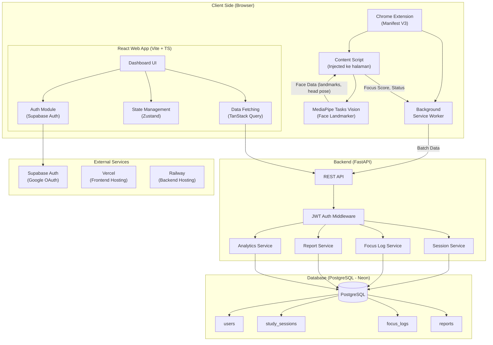
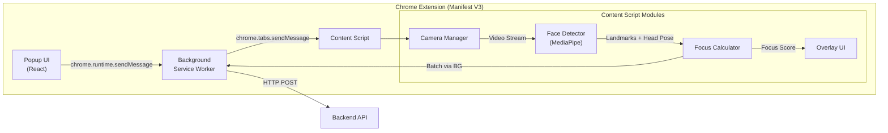
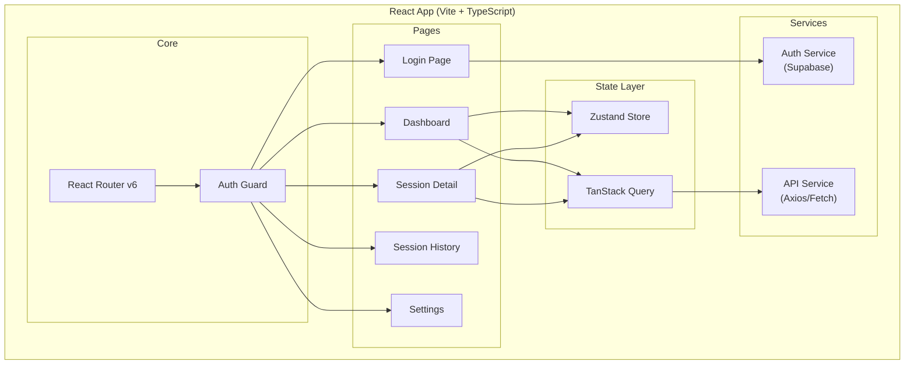
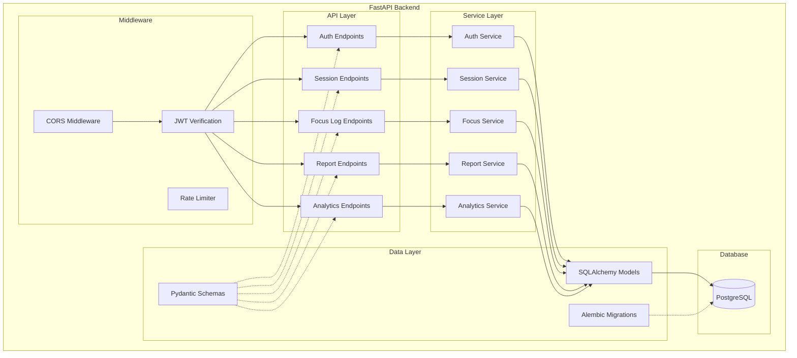
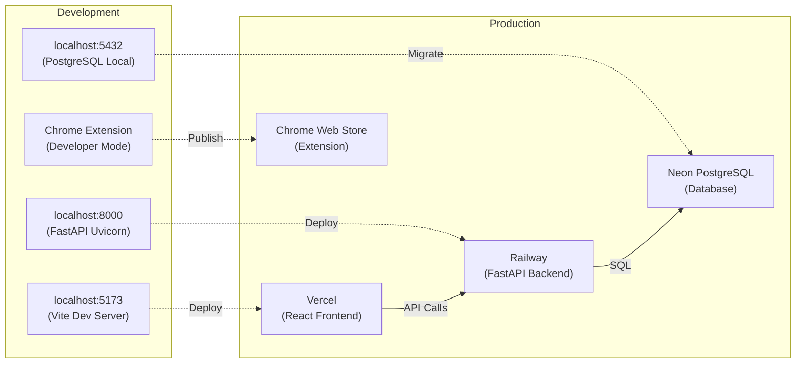

# 📐 Concentra — System Architecture

## 1. High-Level Architecture Overview

Concentra menggunakan arsitektur **Client-Heavy + Lightweight Backend**, di mana semua proses berat (face detection, focus scoring) dilakukan di sisi browser/extension, sementara backend hanya menerima metadata hasil analisis.



## 2. Component Architecture

### 2.1 Chrome Extension Architecture



**Tanggung jawab masing-masing komponen:**

| Komponen | Tanggung Jawab |
|----------|---------------|
| **Popup** | UI kontrol sesi (Start/Stop/Pause), status ringkas, login state |
| **Background Service Worker** | Lifecycle management, batching data, komunikasi dengan backend API |
| **Content Script** | Inject ke halaman target, akses kamera, jalankan MediaPipe, hitung focus score |
| **Camera Manager** | Mengelola akses `getUserMedia`, stream kamera |
| **Face Detector** | Menjalankan MediaPipe Face Landmarker, ekstrak landmarks & head pose |
| **Focus Calculator** | Menghitung focus score berdasarkan face data |
| **Overlay UI** | Menampilkan indikator fokus real-time di halaman target |

### 2.2 React Web App Architecture



### 2.3 Backend Architecture



## 3. Data Flow Architecture

### 3.1 Real-time Focus Monitoring Data Flow

```
┌──────────────┐    Video Frame     ┌──────────────┐    Landmarks      ┌──────────────┐
│              │ ─────────────────> │              │ ──────────────── > │              │
│  Webcam      │                    │  MediaPipe   │                    │  Focus       │
│  (getUserMedia)                   │  Face        │    Head Pose       │  Calculator  │
│              │                    │  Landmarker  │ ──────────────── > │              │
└──────────────┘                    └──────────────┘                    └──────┬───────┘
                                                                              │
                                           Focus Score + Metadata             │
                                    ┌─────────────────────────────────────────┘
                                    │
                                    ▼
                            ┌──────────────┐    Batch (setiap 30s)    ┌──────────────┐
                            │  In-Memory   │ ──────────────────────> │  Background  │
                            │  Buffer      │                          │  Service     │
                            │              │                          │  Worker      │
                            └──────────────┘                          └──────┬───────┘
                                                                             │
                                                                    HTTP POST│(JWT)
                                                                             ▼
                                                                    ┌──────────────┐
                                                                    │  FastAPI     │
                                                                    │  Backend     │
                                                                    └──────┬───────┘
                                                                             │
                                                                             ▼
                                                                    ┌──────────────┐
                                                                    │  PostgreSQL  │
                                                                    │  (Neon)      │
                                                                    └──────────────┘
```

### 3.2 Batching Strategy

- **Interval:** Setiap 30 detik, data focus log di-batch dan dikirim ke backend
- **Buffer Size:** Maksimum 100 entries per batch
- **Retry:** 3x retry dengan exponential backoff jika gagal
- **Offline:** Data disimpan di `chrome.storage.local` jika offline, sync saat online kembali

## 4. Security Architecture

```
┌─────────────────────────────────────────────────────────┐
│                    Security Layers                       │
├─────────────────────────────────────────────────────────┤
│                                                          │
│  1. Authentication: Supabase Auth (Google OAuth 2.0)    │
│     └─ JWT Token issued by Supabase                     │
│                                                          │
│  2. API Security:                                        │
│     ├─ JWT verification on every request                │
│     ├─ CORS whitelist (frontend domain only)            │
│     └─ Rate limiting (100 req/min per user)             │
│                                                          │
│  3. Data Privacy:                                        │
│     ├─ NO video/image data sent to server               │
│     ├─ Only metadata (scores, timestamps, head pose)    │
│     ├─ Face processing 100% client-side                 │
│     └─ Camera stream never leaves browser               │
│                                                          │
│  4. Extension Security:                                  │
│     ├─ Minimal permissions (activeTab, storage)         │
│     ├─ Content Security Policy                          │
│     └─ Host permissions restricted to known domains     │
│                                                          │
│  5. Database Security:                                   │
│     ├─ Parameterized queries (SQLAlchemy ORM)           │
│     ├─ Connection pooling                               │
│     └─ SSL/TLS connection                               │
│                                                          │
└─────────────────────────────────────────────────────────┘
```

## 5. Deployment Architecture



## 6. Technology Stack Summary

| Layer | Technology | Versi | Alasan Pemilihan |
|-------|-----------|-------|-----------------|
| **Frontend Framework** | React + TypeScript | 18.x | Ekosistem besar, type-safety |
| **Build Tool** | Vite | 5.x | Fast HMR, optimal build |
| **Styling** | TailwindCSS | 3.x | Rapid UI development |
| **Routing** | React Router | 6.x | SPA routing standard |
| **State Management** | Zustand | 4.x | Lightweight, minimal boilerplate |
| **Data Fetching** | TanStack Query | 5.x | Caching, refetching, optimistic updates |
| **Face Detection** | MediaPipe Tasks Vision | 0.10.x | Client-side, no server needed |
| **Extension** | Chrome Manifest V3 | V3 | Standar terbaru Chrome |
| **Backend** | FastAPI | 0.100+ | Async, auto-docs, Pydantic v2 |
| **ORM** | SQLAlchemy | 2.x | Mature, async support |
| **Migration** | Alembic | 1.x | Standard untuk SQLAlchemy |
| **Validation** | Pydantic | 2.x | Fast validation, native FastAPI |
| **Auth** | Supabase Auth | Latest | Google OAuth built-in |
| **Database** | PostgreSQL | 15+ | ACID, relational, reliable |
| **DB Hosting** | Neon | - | Serverless PostgreSQL, free tier |
| **Frontend Deploy** | Vercel | - | Zero-config React deployment |
| **Backend Deploy** | Railway | - | Easy Python deployment |
