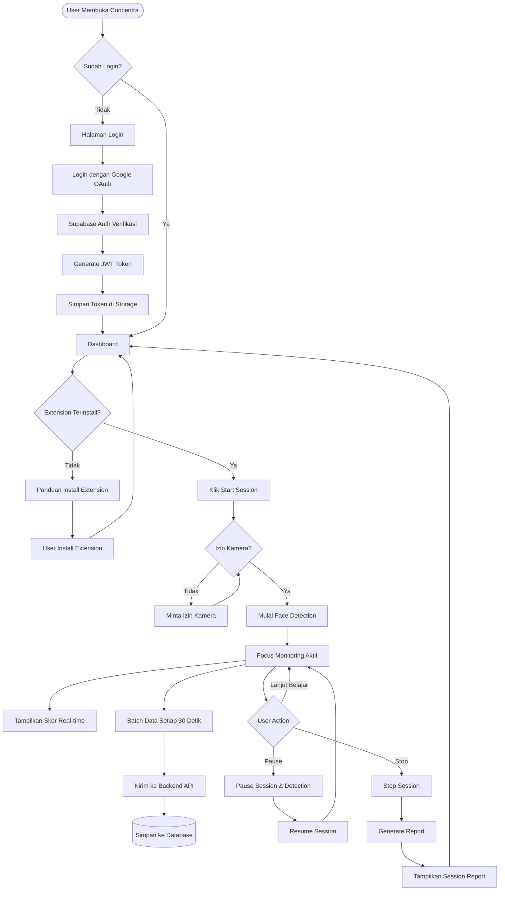
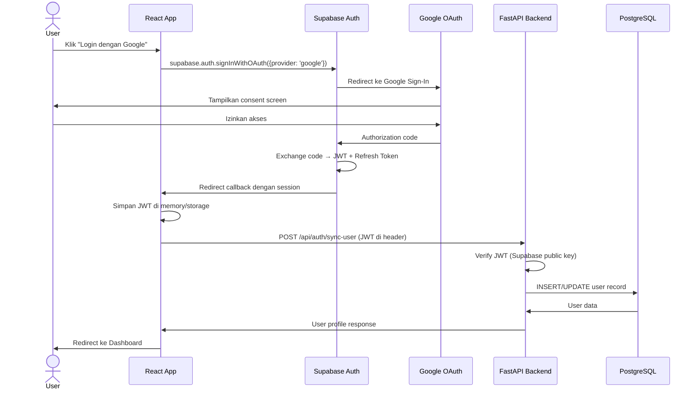
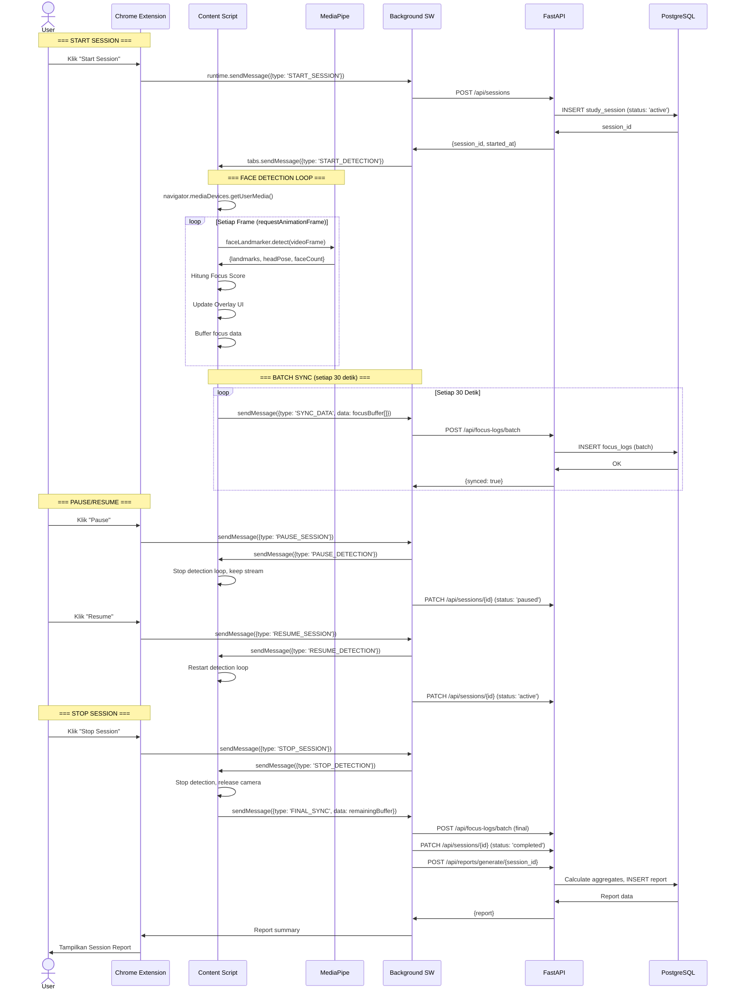
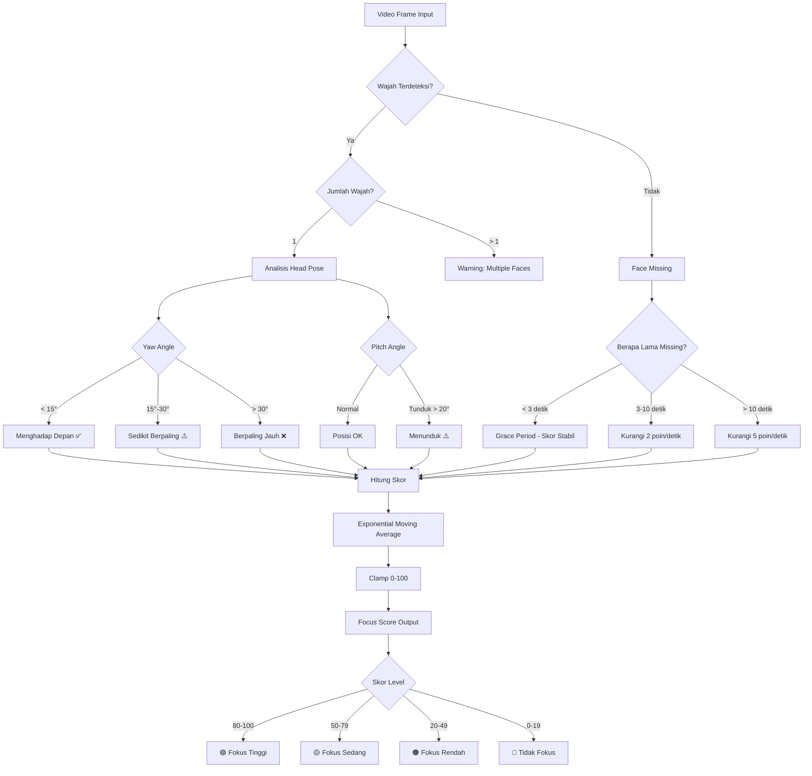
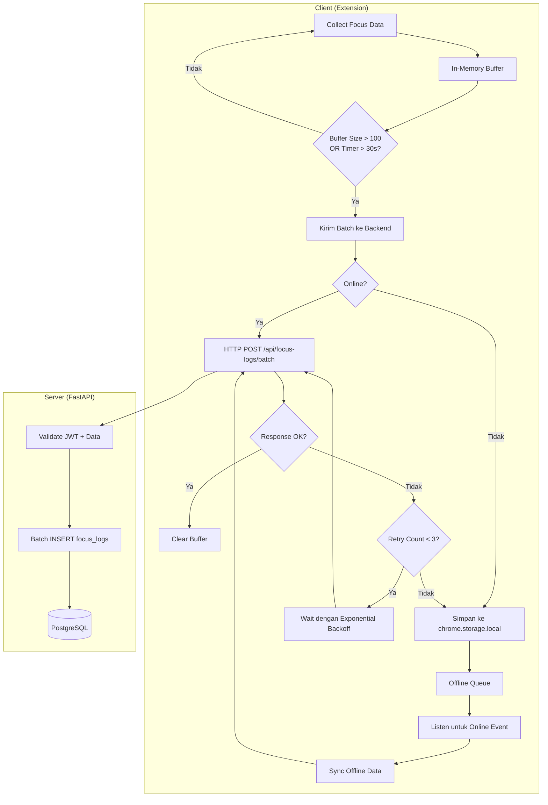
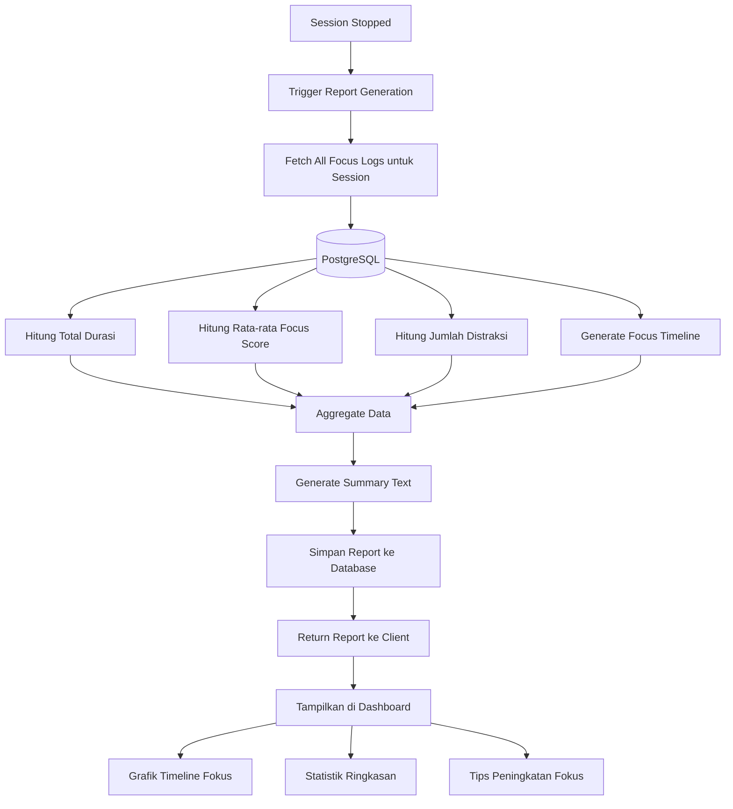

# 🔄 Concentra — Application Flow

## 1. Flow Utama: Login hingga Laporan Sesi



## 2. Flow Authentication



## 3. Flow Study Session



## 4. Flow Focus Score Calculation



### Focus Score Formula

```
Base Score Calculation:
  - face_present = true → base = 100
  - face_present = false → base = previous_score - penalty_per_second

Head Pose Penalties:
  - yaw_penalty = max(0, (|yaw| - 15) * 2)     → 0-30 poin
  - pitch_penalty = max(0, (|pitch| - 20) * 1.5) → 0-20 poin

Distraction Multiplier:
  - consecutive_distraction < 5s  → multiplier = 1.0
  - consecutive_distraction 5-15s → multiplier = 1.5
  - consecutive_distraction > 15s → multiplier = 2.0

Final Score:
  raw_score = base - (yaw_penalty + pitch_penalty) * multiplier
  smoothed_score = α * raw_score + (1 - α) * previous_smoothed_score
  final_score = clamp(smoothed_score, 0, 100)
  
  dimana α = 0.3 (smoothing factor)
```

## 5. Flow Data Synchronization



## 6. Flow Report Generation


