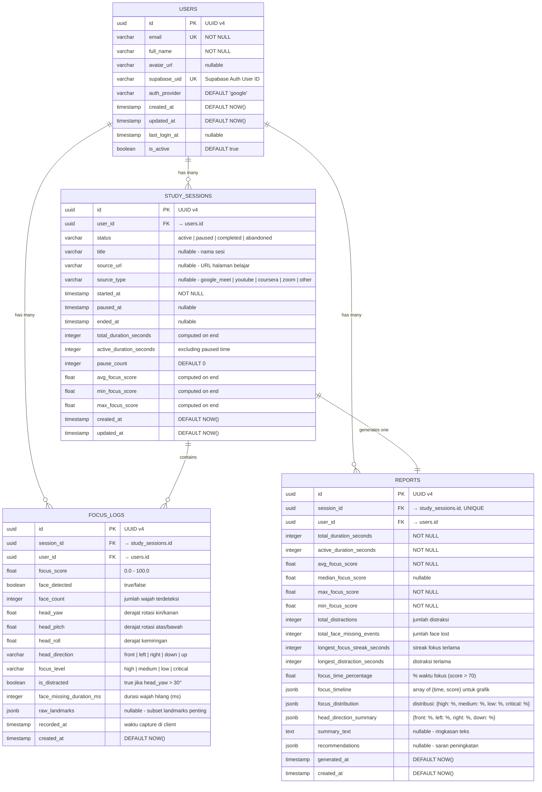

# 🗄️ Concentra — Database Design (ERD)

## 1. Entity Relationship Diagram



## 2. Detail Tabel

### 2.1 Tabel `users`

| Column | Type | Constraint | Keterangan |
|--------|------|-----------|------------|
| `id` | UUID | PK, DEFAULT gen_random_uuid() | Primary key |
| `email` | VARCHAR(255) | NOT NULL, UNIQUE | Email pengguna |
| `full_name` | VARCHAR(255) | NOT NULL | Nama lengkap |
| `avatar_url` | VARCHAR(500) | NULLABLE | URL foto profil Google |
| `supabase_uid` | VARCHAR(255) | UNIQUE, NOT NULL | ID dari Supabase Auth |
| `auth_provider` | VARCHAR(50) | DEFAULT 'google' | Provider auth |
| `created_at` | TIMESTAMP WITH TZ | DEFAULT NOW() | Waktu registrasi |
| `updated_at` | TIMESTAMP WITH TZ | DEFAULT NOW() | Waktu update terakhir |
| `last_login_at` | TIMESTAMP WITH TZ | NULLABLE | Login terakhir |
| `is_active` | BOOLEAN | DEFAULT true | Status aktif |

**Indexes:**
- `idx_users_email` — UNIQUE INDEX on `email`
- `idx_users_supabase_uid` — UNIQUE INDEX on `supabase_uid`

---

### 2.2 Tabel `study_sessions`

| Column | Type | Constraint | Keterangan |
|--------|------|-----------|------------|
| `id` | UUID | PK | Primary key |
| `user_id` | UUID | FK → users.id, NOT NULL | Pemilik sesi |
| `status` | VARCHAR(20) | NOT NULL | active/paused/completed/abandoned |
| `title` | VARCHAR(255) | NULLABLE | Nama sesi (opsional) |
| `source_url` | VARCHAR(500) | NULLABLE | URL halaman belajar |
| `source_type` | VARCHAR(50) | NULLABLE | Tipe platform |
| `started_at` | TIMESTAMP WITH TZ | NOT NULL | Waktu mulai |
| `paused_at` | TIMESTAMP WITH TZ | NULLABLE | Waktu pause terakhir |
| `ended_at` | TIMESTAMP WITH TZ | NULLABLE | Waktu selesai |
| `total_duration_seconds` | INTEGER | NULLABLE | Total durasi (dihitung saat end) |
| `active_duration_seconds` | INTEGER | NULLABLE | Durasi aktif tanpa pause |
| `pause_count` | INTEGER | DEFAULT 0 | Berapa kali pause |
| `avg_focus_score` | FLOAT | NULLABLE | Rata-rata skor fokus |
| `min_focus_score` | FLOAT | NULLABLE | Skor minimum |
| `max_focus_score` | FLOAT | NULLABLE | Skor maksimum |
| `created_at` | TIMESTAMP WITH TZ | DEFAULT NOW() | Waktu dibuat |
| `updated_at` | TIMESTAMP WITH TZ | DEFAULT NOW() | Waktu update |

**Indexes:**
- `idx_sessions_user_id` — INDEX on `user_id`
- `idx_sessions_user_status` — INDEX on `(user_id, status)`
- `idx_sessions_user_started` — INDEX on `(user_id, started_at DESC)`

---

### 2.3 Tabel `focus_logs`

| Column | Type | Constraint | Keterangan |
|--------|------|-----------|------------|
| `id` | UUID | PK | Primary key |
| `session_id` | UUID | FK → study_sessions.id, NOT NULL | Sesi terkait |
| `user_id` | UUID | FK → users.id, NOT NULL | Pemilik (denormalized for query) |
| `focus_score` | FLOAT | NOT NULL, CHECK (0-100) | Skor fokus |
| `face_detected` | BOOLEAN | NOT NULL | Wajah terdeteksi? |
| `face_count` | INTEGER | DEFAULT 0 | Jumlah wajah |
| `head_yaw` | FLOAT | NULLABLE | Rotasi horizontal (derajat) |
| `head_pitch` | FLOAT | NULLABLE | Rotasi vertikal (derajat) |
| `head_roll` | FLOAT | NULLABLE | Kemiringan kepala (derajat) |
| `head_direction` | VARCHAR(10) | NULLABLE | front/left/right/down/up |
| `focus_level` | VARCHAR(10) | NOT NULL | high/medium/low/critical |
| `is_distracted` | BOOLEAN | DEFAULT false | Distraksi? |
| `face_missing_duration_ms` | INTEGER | DEFAULT 0 | Durasi wajah hilang |
| `raw_landmarks` | JSONB | NULLABLE | Subset landmark penting |
| `recorded_at` | TIMESTAMP WITH TZ | NOT NULL | Waktu capture di client |
| `created_at` | TIMESTAMP WITH TZ | DEFAULT NOW() | Waktu insert di server |

**Indexes:**
- `idx_focus_logs_session_id` — INDEX on `session_id`
- `idx_focus_logs_user_id` — INDEX on `user_id`
- `idx_focus_logs_session_recorded` — INDEX on `(session_id, recorded_at)`
- `idx_focus_logs_user_recorded` — INDEX on `(user_id, recorded_at DESC)`

> [!NOTE]
> `user_id` di-denormalize dari `study_sessions` untuk mempercepat query analytics per user tanpa JOIN.

---

### 2.4 Tabel `reports`

| Column | Type | Constraint | Keterangan |
|--------|------|-----------|------------|
| `id` | UUID | PK | Primary key |
| `session_id` | UUID | FK → study_sessions.id, UNIQUE | 1 report per session |
| `user_id` | UUID | FK → users.id, NOT NULL | Pemilik |
| `total_duration_seconds` | INTEGER | NOT NULL | Total durasi sesi |
| `active_duration_seconds` | INTEGER | NOT NULL | Durasi aktif |
| `avg_focus_score` | FLOAT | NOT NULL | Rata-rata skor |
| `median_focus_score` | FLOAT | NULLABLE | Median skor |
| `max_focus_score` | FLOAT | NOT NULL | Skor tertinggi |
| `min_focus_score` | FLOAT | NOT NULL | Skor terendah |
| `total_distractions` | INTEGER | NOT NULL | Jumlah distraksi |
| `total_face_missing_events` | INTEGER | NOT NULL | Jumlah face lost |
| `longest_focus_streak_seconds` | INTEGER | NULLABLE | Streak fokus terlama |
| `longest_distraction_seconds` | INTEGER | NULLABLE | Distraksi terlama |
| `focus_time_percentage` | FLOAT | NULLABLE | % waktu fokus |
| `focus_timeline` | JSONB | NOT NULL | Timeline untuk grafik |
| `focus_distribution` | JSONB | NULLABLE | Distribusi level fokus |
| `head_direction_summary` | JSONB | NULLABLE | Ringkasan arah kepala |
| `summary_text` | TEXT | NULLABLE | Ringkasan teks |
| `recommendations` | JSONB | NULLABLE | Saran peningkatan |
| `generated_at` | TIMESTAMP WITH TZ | DEFAULT NOW() | Waktu generate |
| `created_at` | TIMESTAMP WITH TZ | DEFAULT NOW() | Waktu dibuat |

**Indexes:**
- `idx_reports_session_id` — UNIQUE INDEX on `session_id`
- `idx_reports_user_id` — INDEX on `user_id`
- `idx_reports_user_generated` — INDEX on `(user_id, generated_at DESC)`

## 3. SQL Schema (PostgreSQL)

```sql
-- Enable UUID extension
CREATE EXTENSION IF NOT EXISTS "uuid-ossp";

-- =============================================
-- Table: users
-- =============================================
CREATE TABLE users (
    id UUID PRIMARY KEY DEFAULT uuid_generate_v4(),
    email VARCHAR(255) NOT NULL UNIQUE,
    full_name VARCHAR(255) NOT NULL,
    avatar_url VARCHAR(500),
    supabase_uid VARCHAR(255) NOT NULL UNIQUE,
    auth_provider VARCHAR(50) DEFAULT 'google',
    created_at TIMESTAMPTZ DEFAULT NOW(),
    updated_at TIMESTAMPTZ DEFAULT NOW(),
    last_login_at TIMESTAMPTZ,
    is_active BOOLEAN DEFAULT true
);

CREATE UNIQUE INDEX idx_users_email ON users(email);
CREATE UNIQUE INDEX idx_users_supabase_uid ON users(supabase_uid);

-- =============================================
-- Table: study_sessions
-- =============================================
CREATE TABLE study_sessions (
    id UUID PRIMARY KEY DEFAULT uuid_generate_v4(),
    user_id UUID NOT NULL REFERENCES users(id) ON DELETE CASCADE,
    status VARCHAR(20) NOT NULL DEFAULT 'active'
        CHECK (status IN ('active', 'paused', 'completed', 'abandoned')),
    title VARCHAR(255),
    source_url VARCHAR(500),
    source_type VARCHAR(50)
        CHECK (source_type IN ('google_meet', 'youtube', 'coursera', 'zoom', 'lms', 'other') OR source_type IS NULL),
    started_at TIMESTAMPTZ NOT NULL DEFAULT NOW(),
    paused_at TIMESTAMPTZ,
    ended_at TIMESTAMPTZ,
    total_duration_seconds INTEGER,
    active_duration_seconds INTEGER,
    pause_count INTEGER DEFAULT 0,
    avg_focus_score FLOAT,
    min_focus_score FLOAT,
    max_focus_score FLOAT,
    created_at TIMESTAMPTZ DEFAULT NOW(),
    updated_at TIMESTAMPTZ DEFAULT NOW()
);

CREATE INDEX idx_sessions_user_id ON study_sessions(user_id);
CREATE INDEX idx_sessions_user_status ON study_sessions(user_id, status);
CREATE INDEX idx_sessions_user_started ON study_sessions(user_id, started_at DESC);

-- =============================================
-- Table: focus_logs
-- =============================================
CREATE TABLE focus_logs (
    id UUID PRIMARY KEY DEFAULT uuid_generate_v4(),
    session_id UUID NOT NULL REFERENCES study_sessions(id) ON DELETE CASCADE,
    user_id UUID NOT NULL REFERENCES users(id) ON DELETE CASCADE,
    focus_score FLOAT NOT NULL CHECK (focus_score >= 0 AND focus_score <= 100),
    face_detected BOOLEAN NOT NULL,
    face_count INTEGER DEFAULT 0,
    head_yaw FLOAT,
    head_pitch FLOAT,
    head_roll FLOAT,
    head_direction VARCHAR(10)
        CHECK (head_direction IN ('front', 'left', 'right', 'down', 'up') OR head_direction IS NULL),
    focus_level VARCHAR(10) NOT NULL
        CHECK (focus_level IN ('high', 'medium', 'low', 'critical')),
    is_distracted BOOLEAN DEFAULT false,
    face_missing_duration_ms INTEGER DEFAULT 0,
    raw_landmarks JSONB,
    recorded_at TIMESTAMPTZ NOT NULL,
    created_at TIMESTAMPTZ DEFAULT NOW()
);

CREATE INDEX idx_focus_logs_session_id ON focus_logs(session_id);
CREATE INDEX idx_focus_logs_user_id ON focus_logs(user_id);
CREATE INDEX idx_focus_logs_session_recorded ON focus_logs(session_id, recorded_at);
CREATE INDEX idx_focus_logs_user_recorded ON focus_logs(user_id, recorded_at DESC);

-- =============================================
-- Table: reports
-- =============================================
CREATE TABLE reports (
    id UUID PRIMARY KEY DEFAULT uuid_generate_v4(),
    session_id UUID NOT NULL UNIQUE REFERENCES study_sessions(id) ON DELETE CASCADE,
    user_id UUID NOT NULL REFERENCES users(id) ON DELETE CASCADE,
    total_duration_seconds INTEGER NOT NULL,
    active_duration_seconds INTEGER NOT NULL,
    avg_focus_score FLOAT NOT NULL,
    median_focus_score FLOAT,
    max_focus_score FLOAT NOT NULL,
    min_focus_score FLOAT NOT NULL,
    total_distractions INTEGER NOT NULL DEFAULT 0,
    total_face_missing_events INTEGER NOT NULL DEFAULT 0,
    longest_focus_streak_seconds INTEGER,
    longest_distraction_seconds INTEGER,
    focus_time_percentage FLOAT,
    focus_timeline JSONB NOT NULL DEFAULT '[]',
    focus_distribution JSONB,
    head_direction_summary JSONB,
    summary_text TEXT,
    recommendations JSONB,
    generated_at TIMESTAMPTZ DEFAULT NOW(),
    created_at TIMESTAMPTZ DEFAULT NOW()
);

CREATE UNIQUE INDEX idx_reports_session_id ON reports(session_id);
CREATE INDEX idx_reports_user_id ON reports(user_id);
CREATE INDEX idx_reports_user_generated ON reports(user_id, generated_at DESC);

-- =============================================
-- Trigger: Auto update `updated_at`
-- =============================================
CREATE OR REPLACE FUNCTION update_updated_at_column()
RETURNS TRIGGER AS $$
BEGIN
    NEW.updated_at = NOW();
    RETURN NEW;
END;
$$ language 'plpgsql';

CREATE TRIGGER update_users_updated_at
    BEFORE UPDATE ON users
    FOR EACH ROW EXECUTE FUNCTION update_updated_at_column();

CREATE TRIGGER update_sessions_updated_at
    BEFORE UPDATE ON study_sessions
    FOR EACH ROW EXECUTE FUNCTION update_updated_at_column();
```

## 4. Query Patterns yang Dioptimalkan

### 4.1 Dashboard Queries

```sql
-- Total waktu belajar user
SELECT COALESCE(SUM(active_duration_seconds), 0) as total_study_time
FROM study_sessions
WHERE user_id = $1 AND status = 'completed';

-- Rata-rata focus score user
SELECT COALESCE(AVG(avg_focus_score), 0) as overall_avg_focus
FROM study_sessions
WHERE user_id = $1 AND status = 'completed';

-- Statistik mingguan
SELECT 
    DATE_TRUNC('day', started_at) as study_date,
    COUNT(*) as session_count,
    SUM(active_duration_seconds) as total_duration,
    AVG(avg_focus_score) as avg_focus
FROM study_sessions
WHERE user_id = $1 
    AND status = 'completed'
    AND started_at >= NOW() - INTERVAL '7 days'
GROUP BY DATE_TRUNC('day', started_at)
ORDER BY study_date;
```

### 4.2 Session History

```sql
-- Riwayat sesi dengan report
SELECT 
    s.id, s.title, s.source_type, s.started_at, s.ended_at,
    s.active_duration_seconds, s.avg_focus_score, s.status,
    r.total_distractions, r.focus_time_percentage
FROM study_sessions s
LEFT JOIN reports r ON r.session_id = s.id
WHERE s.user_id = $1
ORDER BY s.started_at DESC
LIMIT $2 OFFSET $3;
```

### 4.3 Focus Timeline for Chart

```sql
-- Focus timeline dari focus_logs untuk grafik real-time
SELECT 
    DATE_TRUNC('minute', recorded_at) as time_bucket,
    AVG(focus_score) as avg_score,
    MIN(focus_score) as min_score,
    MAX(focus_score) as max_score,
    COUNT(*) FILTER (WHERE is_distracted = true) as distraction_count
FROM focus_logs
WHERE session_id = $1
GROUP BY time_bucket
ORDER BY time_bucket;
```

## 5. Data Volume Estimation

| Metric | Nilai | Keterangan |
|--------|-------|------------|
| Focus log per detik | ~1 entry | Sampling setiap 1 detik |
| Logs per jam | ~3,600 | Per sesi aktif |
| Batch size | ~30 entries | Setiap 30 detik |
| Rata-rata sesi | ~1-2 jam | Durasi belajar typical |
| Logs per sesi | ~3,600-7,200 | Per sesi |
| Sesi per user/hari | ~2-3 | Estimasi |
| Logs per user/hari | ~10,000-20,000 | Estimasi |
| Target 1000 users | ~10M-20M logs/bulan | Perlu partitioning nanti |

> [!WARNING]
> Untuk skala > 1000 active users, pertimbangkan table partitioning pada `focus_logs` berdasarkan `recorded_at` (monthly partitions) dan data retention policy (hapus detail logs > 90 hari, simpan aggregated reports selamanya).
