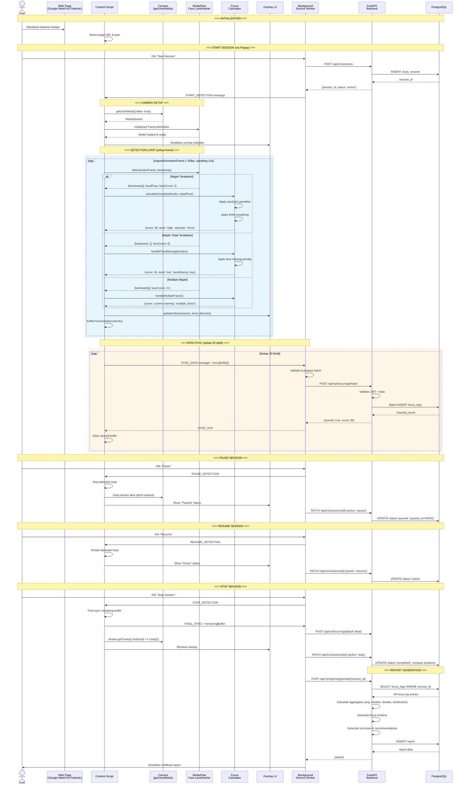
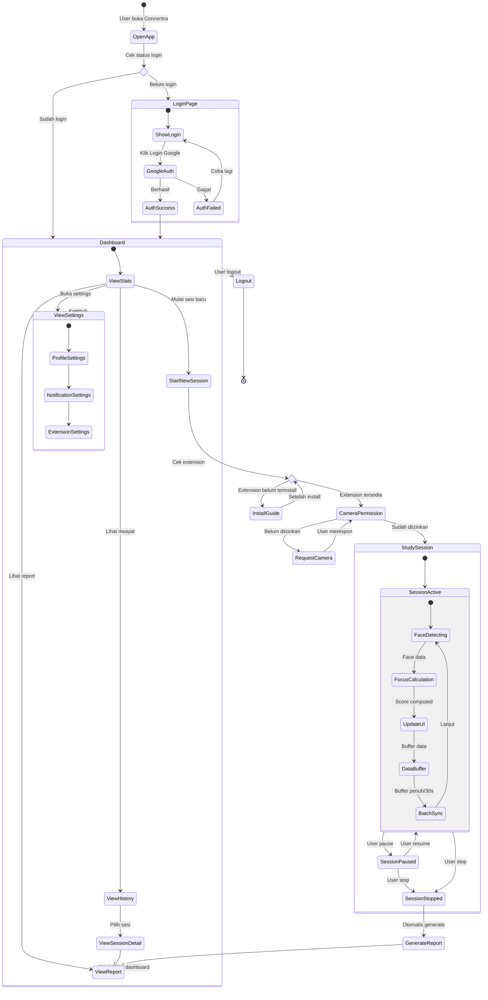
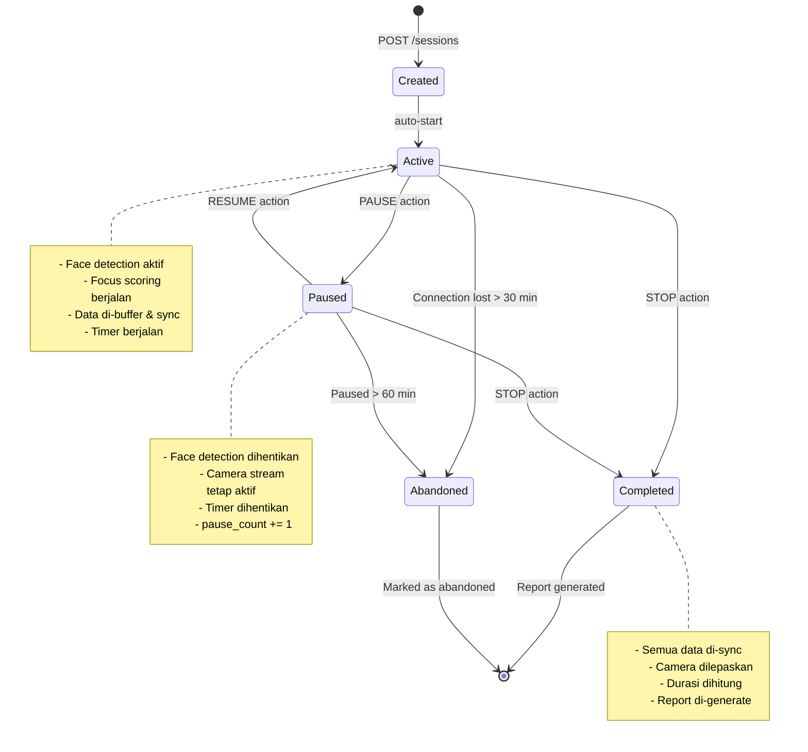
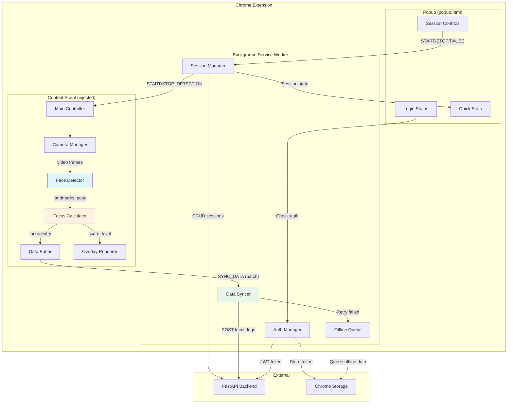
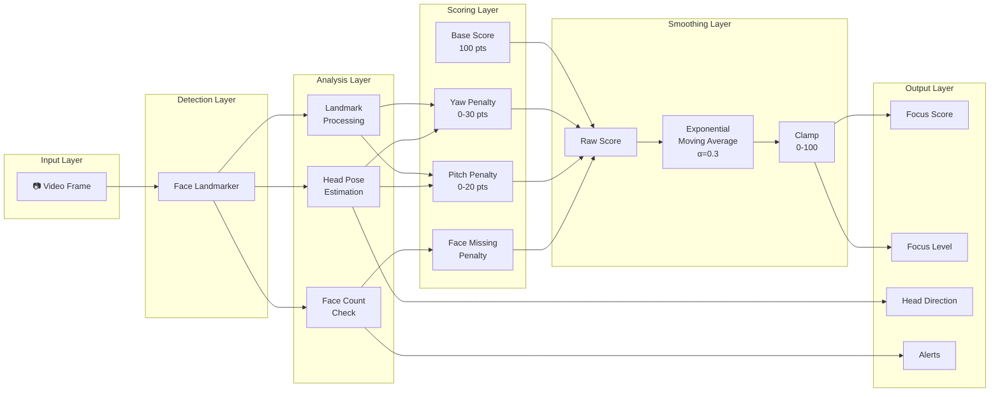

# 📊 Concentra — Diagrams

## 1. Sequence Diagram: Focus Monitoring Process

## 2. Activity Diagram: User Journey

## 3. State Diagram: Study Session States

## 4. Component Interaction Diagram: Chrome Extension

## 5. Data Flow Diagram: Focus Score Pipeline

