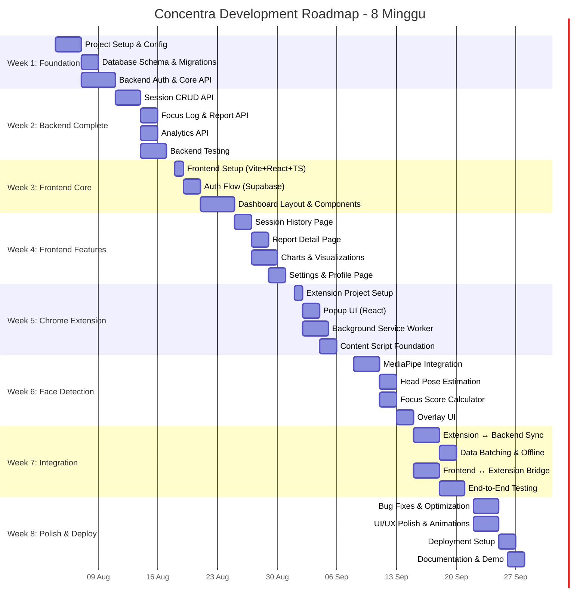

# 🗺️ Concentra — Development Roadmap (8 Minggu)

## Overview Timeline

---

## Week 1: Foundation & Backend Core (4-10 Agustus 2026)

### Objectives
- Setup proyek dan tooling
- Implementasi database schema
- Backend authentication

### Tasks

| # | Task | Status | Priority | Estimasi |
|---|------|--------|----------|----------|
| 1.1 | Setup monorepo structure | ✅ Selesai | 🔴 Critical | 2 jam |
| 1.2 | Setup backend FastAPI project | ✅ Selesai | 🔴 Critical | 2 jam |
| 1.3 | Konfigurasi PostgreSQL lokal + Neon | ✅ Selesai | 🔴 Critical | 2 jam |
| 1.4 | Setup SQLAlchemy + Alembic | ✅ Selesai | 🔴 Critical | 3 jam |
| 1.5 | Buat semua database models | ✅ Selesai | 🔴 Critical | 4 jam |
| 1.6 | Buat initial migration | ✅ Selesai | 🔴 Critical | 1 jam |
| 1.7 | Setup Supabase project + Google OAuth / dev auth | ✅ Selesai | 🔴 Critical | 3 jam |
| 1.8 | Implementasi JWT verification middleware | ✅ Selesai | 🔴 Critical | 4 jam |
| 1.9 | Implementasi auth endpoints | ✅ Selesai | 🔴 Critical | 4 jam |
| 1.10 | Setup docker-compose untuk local dev | ✅ Selesai | 🟡 Medium | 2 jam |
| 1.11 | Setup linting & formatting (ruff, pyproject) | ✅ Selesai | 🟢 Low | 1 jam |

### Deliverables
- ✅ Monorepo structure lengkap
- ✅ Backend berjalan di `localhost:8000`
- ✅ Database schema ter-migrate
- ✅ Auth endpoints berfungsi (sync-user, me)
- ✅ JWT verification bekerja
- ✅ Docker-compose untuk PostgreSQL

---

## Week 2: Backend Complete (11-17 Agustus 2026)

### Objectives
- Selesaikan semua backend API
- Unit testing backend

### Tasks

| # | Task | Status | Priority | Estimasi |
|---|------|--------|----------|----------|
| 2.1 | Session CRUD endpoints | ✅ Selesai | 🔴 Critical | 6 jam |
| 2.2 | Session state management (pause/resume/stop) | ✅ Selesai | 🔴 Critical | 4 jam |
| 2.3 | Focus log batch endpoint | ✅ Selesai | 🔴 Critical | 4 jam |
| 2.4 | Focus log query endpoints | ✅ Selesai | 🟡 Medium | 3 jam |
| 2.5 | Report generation logic | ✅ Selesai | 🔴 Critical | 6 jam |
| 2.6 | Report CRUD endpoints | ✅ Selesai | 🔴 Critical | 3 jam |
| 2.7 | Analytics summary endpoint | ✅ Selesai | 🟡 Medium | 4 jam |
| 2.8 | Analytics weekly/daily endpoints | ✅ Selesai | 🟡 Medium | 4 jam |
| 2.9 | Focus trend & study pattern endpoints | ✅ Selesai | 🟡 Medium | 4 jam |
| 2.10 | Setup pytest + test fixtures | ✅ Selesai | 🟡 Medium | 3 jam |
| 2.11 | Unit tests untuk semua services | ✅ Selesai | 🟡 Medium | 6 jam |
| 2.12 | API integration tests | ✅ Selesai | 🟡 Medium | 4 jam |

### Deliverables
- ✅ Semua 25+ API endpoints berfungsi
- ✅ Report generation otomatis
- ✅ Analytics calculations benar
- ✅ Test coverage > 70%
- ✅ API documentation (Swagger/ReDoc)

---

## Week 3: Frontend Core (18-24 Agustus 2026)

### Objectives
- Setup frontend project
- Implementasi auth flow
- Dashboard utama

### Tasks

| # | Task | Status | Priority | Estimasi |
|---|------|--------|----------|----------|
| 3.1 | Setup Vite + React + TypeScript | ✅ Selesai | 🔴 Critical | 2 jam |
| 3.2 | Setup TailwindCSS | ✅ Selesai | 🔴 Critical | 1 jam |
| 3.3 | Setup React Router + route config | ✅ Selesai | 🔴 Critical | 2 jam |
| 3.4 | Setup Zustand stores | ✅ Selesai | 🔴 Critical | 2 jam |
| 3.5 | Setup TanStack Query + API service | ✅ Selesai | 🔴 Critical | 3 jam |
| 3.6 | Supabase client initialization | ✅ Selesai | 🔴 Critical | 1 jam |
| 3.7 | Login page UI | ✅ Selesai | 🔴 Critical | 4 jam |
| 3.8 | Google OAuth flow implementation | ✅ Selesai | 🔴 Critical | 4 jam |
| 3.9 | Auth guard (protected routes) | ✅ Selesai | 🔴 Critical | 2 jam |
| 3.10 | Design system: base UI components | ✅ Selesai | 🔴 Critical | 6 jam |
| 3.11 | Main layout (sidebar, header) | ✅ Selesai | 🔴 Critical | 4 jam |
| 3.12 | Dashboard page - stats cards | ✅ Selesai | 🟡 Medium | 4 jam |
| 3.13 | Dashboard page - recent sessions list | ✅ Selesai | 🟡 Medium | 3 jam |
| 3.14 | Dashboard page - weekly chart | ✅ Selesai | 🟡 Medium | 4 jam |

### Deliverables
- ✅ Frontend berjalan di `localhost:5173`
- ✅ Login/logout dengan Google berfungsi
- ✅ Dashboard menampilkan data dari API
- ✅ Responsive design (desktop + tablet)
- ✅ Design system components (Button, Card, Input, etc.)

---

## Week 4: Frontend Features (25-31 Agustus 2026)

### Objectives
- Halaman-halaman fitur
- Charts dan visualisasi
- Polish UI

### Tasks

| # | Task | Priority | Estimasi |
|---|------|----------|----------|
| 4.1 | Session History page + pagination | 🔴 Critical | 4 jam |
| 4.2 | Session Detail page | 🔴 Critical | 4 jam |
| 4.3 | Report Detail page | 🔴 Critical | 6 jam |
| 4.4 | Focus Line Chart (timeline) | 🔴 Critical | 4 jam |
| 4.5 | Focus Distribution Pie Chart | 🟡 Medium | 3 jam |
| 4.6 | Weekly Bar Chart | 🟡 Medium | 3 jam |
| 4.7 | Focus Heatmap | 🟢 Low | 4 jam |
| 4.8 | Settings page | 🟡 Medium | 3 jam |
| 4.9 | Profile page | 🟡 Medium | 2 jam |
| 4.10 | Empty states & loading states | 🟡 Medium | 3 jam |
| 4.11 | Error handling & toast notifications | 🟡 Medium | 2 jam |
| 4.12 | Dark mode support | 🟢 Low | 4 jam |

### Deliverables
- ✅ Semua halaman frontend lengkap
- ✅ Charts interaktif berfungsi
- ✅ Loading & error states
- ✅ Dark mode (optional)
- ✅ Responsive di semua device

---

## Week 5: Chrome Extension (1-7 September 2026)

### Objectives
- Setup Chrome Extension project
- Popup UI
- Background service worker
- Content script foundation

### Tasks

| # | Task | Priority | Estimasi |
|---|------|----------|----------|
| 5.1 | Extension project setup (Vite + React + TS) | 🔴 Critical | 3 jam |
| 5.2 | Manifest V3 configuration | 🔴 Critical | 2 jam |
| 5.3 | Build pipeline (popup + content + background) | 🔴 Critical | 4 jam |
| 5.4 | Popup UI - Login state | 🔴 Critical | 3 jam |
| 5.5 | Popup UI - Session controls | 🔴 Critical | 4 jam |
| 5.6 | Popup UI - Quick stats & focus indicator | 🟡 Medium | 3 jam |
| 5.7 | Background SW - Session lifecycle | 🔴 Critical | 4 jam |
| 5.8 | Background SW - API client | 🔴 Critical | 3 jam |
| 5.9 | Background SW - Auth token management | 🔴 Critical | 3 jam |
| 5.10 | Content script - Page detection logic | 🟡 Medium | 2 jam |
| 5.11 | Content script - Message handling | 🔴 Critical | 3 jam |
| 5.12 | Chrome messaging utilities | 🔴 Critical | 3 jam |
| 5.13 | Chrome storage utilities | 🟡 Medium | 2 jam |

### Deliverables
- ✅ Extension dapat di-load di Chrome (developer mode)
- ✅ Popup UI berfungsi
- ✅ Background SW mengelola session
- ✅ Content script ter-inject ke halaman target
- ✅ Messaging antara popup ↔ background ↔ content bekerja

---

## Week 6: Face Detection & Focus Monitoring (8-14 September 2026)

### Objectives
- Integrasi MediaPipe Face Landmarker
- Implementasi head pose estimation
- Focus score calculation
- Real-time overlay UI

### Tasks

| # | Task | Priority | Estimasi |
|---|------|----------|----------|
| 6.1 | Camera Manager (getUserMedia wrapper) | 🔴 Critical | 3 jam |
| 6.2 | MediaPipe Face Landmarker setup | 🔴 Critical | 4 jam |
| 6.3 | Face detection loop (requestAnimationFrame) | 🔴 Critical | 4 jam |
| 6.4 | Landmark processing & extraction | 🔴 Critical | 3 jam |
| 6.5 | Head pose estimation (yaw, pitch, roll) | 🔴 Critical | 6 jam |
| 6.6 | Head direction classification | 🔴 Critical | 2 jam |
| 6.7 | Focus score calculation engine | 🔴 Critical | 6 jam |
| 6.8 | EMA smoothing implementation | 🟡 Medium | 2 jam |
| 6.9 | Face missing detection & grace period | 🟡 Medium | 3 jam |
| 6.10 | Multiple face handling | 🟡 Medium | 2 jam |
| 6.11 | Overlay UI - focus indicator widget | 🔴 Critical | 4 jam |
| 6.12 | Overlay UI - status badge | 🟡 Medium | 2 jam |
| 6.13 | Performance optimization (frame skip) | 🟡 Medium | 3 jam |

### Deliverables
- ✅ Face detection berjalan di content script
- ✅ Head pose estimation akurat
- ✅ Focus score dihitung real-time
- ✅ Overlay indicator tampil di halaman
- ✅ Performance < 10% CPU pada idle

---

## Week 7: Integration & Testing (15-21 September 2026)

### Objectives
- Integrasi Extension ↔ Backend
- Data synchronization
- End-to-end testing

### Tasks

| # | Task | Priority | Estimasi |
|---|------|----------|----------|
| 7.1 | Data batching di content script | 🔴 Critical | 3 jam |
| 7.2 | Data syncer di background SW | 🔴 Critical | 4 jam |
| 7.3 | Offline queue & retry logic | 🟡 Medium | 4 jam |
| 7.4 | Extension auth flow (sync with web app) | 🔴 Critical | 4 jam |
| 7.5 | Web app ↔ Extension communication | 🟡 Medium | 3 jam |
| 7.6 | Session start/stop → report generation flow | 🔴 Critical | 4 jam |
| 7.7 | Dashboard real-time update | 🟡 Medium | 3 jam |
| 7.8 | E2E test: full session lifecycle | 🔴 Critical | 4 jam |
| 7.9 | E2E test: data integrity check | 🟡 Medium | 3 jam |
| 7.10 | Cross-platform testing (Google Meet, YouTube) | 🟡 Medium | 4 jam |
| 7.11 | Performance profiling & optimization | 🟡 Medium | 4 jam |
| 7.12 | Fix integration bugs | 🔴 Critical | 6 jam |

### Deliverables
- ✅ Full flow berfungsi: login → session → detection → report
- ✅ Data sync reliabel (online & offline)
- ✅ Extension bekerja di Google Meet, YouTube, Coursera
- ✅ Performance acceptable
- ✅ No critical bugs

---

## Week 8: Polish, Deploy & Documentation (22-28 September 2026)

### Objectives
- Bug fixes
- UI/UX polish
- Deployment ke production
- Dokumentasi

### Tasks

| # | Task | Priority | Estimasi |
|---|------|----------|----------|
| 8.1 | Bug fixes dari testing week 7 | 🔴 Critical | 6 jam |
| 8.2 | UI animations & micro-interactions | 🟡 Medium | 4 jam |
| 8.3 | Loading skeletons & transitions | 🟡 Medium | 3 jam |
| 8.4 | Accessibility improvements | 🟡 Medium | 3 jam |
| 8.5 | Deploy frontend ke Vercel | 🔴 Critical | 2 jam |
| 8.6 | Deploy backend ke Railway | 🔴 Critical | 3 jam |
| 8.7 | Setup Neon PostgreSQL production | 🔴 Critical | 2 jam |
| 8.8 | Environment variables & secrets | 🔴 Critical | 1 jam |
| 8.9 | CORS & security configuration | 🔴 Critical | 2 jam |
| 8.10 | Extension packaging | 🟡 Medium | 2 jam |
| 8.11 | README documentation | 🟡 Medium | 4 jam |
| 8.12 | API documentation finalization | 🟡 Medium | 2 jam |
| 8.13 | Demo video/recording | 🟢 Low | 3 jam |
| 8.14 | Final testing di production | 🔴 Critical | 4 jam |

### Deliverables
- ✅ Aplikasi production-ready
- ✅ Frontend live di Vercel
- ✅ Backend live di Railway
- ✅ Database di Neon
- ✅ Extension siap distribute
- ✅ Dokumentasi lengkap
- ✅ Demo tersedia

---

## Summary per Milestone

| Week | Fokus | Key Deliverable | Effort (jam) |
|------|-------|----------------|-------------|
| 1 | Foundation | Backend + DB + Auth | ~28 jam |
| 2 | Backend Complete | All APIs + Tests | ~51 jam |
| 3 | Frontend Core | Login + Dashboard | ~42 jam |
| 4 | Frontend Features | All Pages + Charts | ~42 jam |
| 5 | Chrome Extension | Popup + BG + Content | ~39 jam |
| 6 | Face Detection | MediaPipe + Focus Score | ~44 jam |
| 7 | Integration | E2E Flow + Testing | ~46 jam |
| 8 | Deploy & Polish | Production + Docs | ~41 jam |
| **Total** | | | **~333 jam** |

> [!NOTE]
> Estimasi berdasarkan pengembang tunggal yang bekerja ~6 jam/hari. Jika bekerja dalam tim, timeline dapat diperpendek signifikan dengan paralelisasi (misalnya: frontend dan backend dikerjakan bersamaan).
