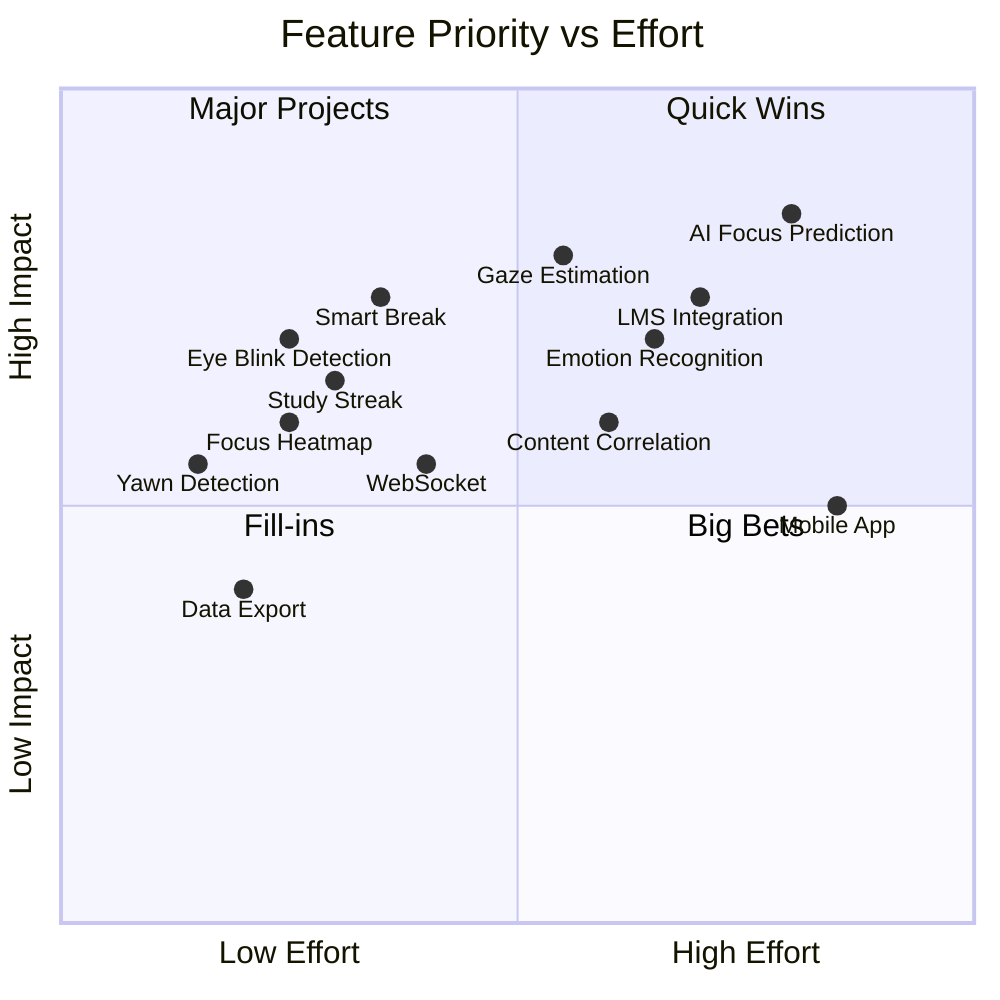

# 🚀 Concentra — Saran Pengembangan Lanjutan

## 1. Advanced Face Analysis Features

### 1.1 Eye Blink Detection (Deteksi Kedipan Mata)

**Deskripsi:**
Deteksi frekuensi kedipan mata untuk mengukur tingkat kelelahan dan kantuk pengguna.

**Implementasi:**
```
Menggunakan MediaPipe Face Landmarks:
- Landmark mata: titik 33, 160, 158, 133, 153, 144 (mata kiri)
                 titik 362, 385, 387, 263, 373, 380 (mata kanan)
- Eye Aspect Ratio (EAR) = (|p2-p6| + |p3-p5|) / (2 × |p1-p4|)
- Blink terdeteksi jika EAR < threshold (0.2) selama > 1 frame

Metrics yang dihasilkan:
- Blink rate (per menit) → normal: 15-20x/menit
- Prolonged blink detection → > 500ms = micro-sleep
- Blink pattern anomaly → irregular = fatigue indicator
```

**Manfaat:**
- Deteksi kelelahan sebelum user menyadari
- Alert istirahat otomatis
- Korelasi blink rate dengan focus score

**Effort:** ~2-3 hari

---

### 1.2 Yawn Detection (Deteksi Menguap)

**Deskripsi:**
Deteksi menguap untuk mengukur tingkat kantuk dan kebutuhan istirahat.

**Implementasi:**
```
Menggunakan MediaPipe Face Landmarks:
- Landmark mulut: titik 13 (bibir atas), 14 (bibir bawah)
- Mouth Aspect Ratio (MAR) = distance(13, 14) / face_height
- Yawn terdeteksi jika MAR > threshold (0.6) selama > 1.5 detik

Scoring:
- 0 yawn/30 min → Score bonus +5
- 1-2 yawn/30 min → Netral
- 3+ yawn/30 min → Score penalty -10, alert istirahat
```

**Manfaat:**
- Deteksi kebutuhan istirahat
- Rekomendasi break time
- Indikator produktivitas jangka panjang

**Effort:** ~1-2 hari

---

### 1.3 Emotion Recognition (Pengenalan Emosi)

**Deskripsi:**
Mengenali emosi dasar (senang, bingung, frustasi, bosan, netral) dari ekspresi wajah untuk memahami state emosional selama belajar.

**Implementasi:**
```
Pendekatan:
1. Rule-based dari landmarks (lebih ringan):
   - Bingung: alis naik + mulut terbuka sedikit
   - Frustasi: alis turun + rahang kencang
   - Bosan: kepala condong + mata sayu (EAR rendah)
   - Senang: sudut mulut naik

2. ML-based (lebih akurat, future):
   - TensorFlow.js + custom emotion model
   - Training dari dataset FER2013 / AffectNet
   - Output: probability per emosi
```

**Manfaat:**
- Insight lebih dalam tentang engagement
- Deteksi momen kebingungan → saran review materi
- Korelasi emosi dengan retensi belajar

**Effort:** ~1 minggu (rule-based), ~2-3 minggu (ML-based)

---

### 1.4 Gaze Estimation (Estimasi Arah Pandang)

**Deskripsi:**
Estimasi apakah user melihat layar, melihat ke tempat lain, atau melihat handphone.

**Implementasi:**
```
Menggunakan MediaPipe Face Landmarks:
- Iris landmarks (titik 468-477 untuk mata kiri/kanan)
- Hitung posisi iris relatif terhadap eye region
- Estimasi gaze direction (on-screen, off-screen)

Enhanced dengan:
- Screen region mapping (melihat area mana di layar)
- Phone usage detection (gaze consistently downward-left/right)
```

**Manfaat:**
- Lebih akurat daripada hanya head pose
- Deteksi micro-distractions (melirik HP)
- Per-section focus analysis (bagian mana dari layar yang paling diperhatikan)

**Effort:** ~1 minggu

---

## 2. AI-Powered Features

### 2.1 AI Focus Prediction

**Deskripsi:**
Model ML yang memprediksi kapan focus user akan turun berdasarkan pattern historis.

**Implementasi:**
```
Model: Time-series prediction (LSTM/Transformer)

Input features:
- Historical focus scores (last 30 minutes)
- Time of day
- Session duration so far
- Blink rate trend
- Head movement frequency
- Day of week
- Historical pattern (user-specific)

Output:
- Predicted focus score 5-10 menit ke depan
- Confidence interval
- Recommended action (take break, change topic, etc.)

Training:
- Per-user model (personalized)
- Transfer learning dari aggregate model
- Re-train setiap minggu dengan data baru
```

**Manfaat:**
- Proactive break suggestions
- Optimal study session planning
- Personalized learning insights

**Effort:** ~2-3 minggu

---

### 2.2 Smart Break Recommendations

**Deskripsi:**
Algoritma yang merekomendasikan waktu istirahat optimal berdasarkan pattern fokus.

**Implementasi:**
```
Rules:
1. Pomodoro-based: 25 min study → 5 min break (default)
2. AI-adjusted: modify interval berdasarkan user pattern
3. Focus-drop triggered: jika score < 40 selama > 5 menit → suggest break
4. Fatigue-triggered: blink rate > 25/min → suggest break

Break activities:
- "Lakukan stretching 2 menit"
- "Lihat objek jauh selama 20 detik (20-20-20 rule)"
- "Minum air putih"
- "Tarik napas dalam 5 kali"
```

**Effort:** ~3-5 hari

---

### 2.3 Content Difficulty Correlation

**Deskripsi:**
Mengkorelasikan focus score dengan konten yang sedang dipelajari untuk mengidentifikasi materi yang sulit.

**Implementasi:**
```
- Capture page title/URL changes during session
- Map focus score drops to content timestamps
- YouTube: correlate with video timestamps
- PDF/Article: correlate with scroll position
- Generate "difficulty map" per content

Output:
- "Fokus Anda turun saat video mencapai menit 15:30-20:00"
- "Materi tentang Calculus III membuat fokus Anda 30% lebih rendah"
```

**Effort:** ~1-2 minggu

---

## 3. Dashboard Analytics Enhancement

### 3.1 Comparative Analytics

```
Fitur:
- Bandingkan fokus minggu ini vs minggu lalu
- Bandingkan fokus per platform (YouTube vs Google Meet)
- Bandingkan fokus per subject/topic
- Leaderboard anonim (opt-in) untuk motivasi
```

### 3.2 Productivity Insights

```
Fitur:
- "Jam terbaik Anda untuk belajar: 09:00-11:00"
- "Fokus Anda 15% lebih baik di pagi hari"
- "Sesi belajar optimal Anda: 45 menit"
- "Hari paling produktif: Selasa"
- Weekly email digest dengan insights
```

### 3.3 Study Streak & Gamification

```
Fitur:
- Daily study streak (seperti GitHub contribution graph)
- Achievement badges:
  - "7-Day Streak" 🔥
  - "Focus Master" (avg score > 90) 🎯
  - "Night Owl" (study after 22:00) 🦉
  - "Early Bird" (study before 07:00) 🐦
  - "Marathon Runner" (3+ jam continuous) 🏃
- Weekly challenges
- XP system & level progression
```

### 3.4 Focus Heatmap

```
Fitur:
- Heatmap 7x24 (hari × jam) menunjukkan kapan user paling fokus
- Color gradient: merah (low focus) → hijau (high focus)
- Overlay session duration circles
- Identify optimal study windows
```

---

## 4. Platform & Integration Expansion

### 4.1 Multi-Browser Support

```
Timeline: Post-MVP
- Firefox Extension (WebExtension API compatible)
- Safari Extension (requires significant rework)
- Edge Extension (mostly compatible with Chrome)
```

### 4.2 LMS Integration

```
Integrasi dengan:
- Moodle (plugin)
- Canvas LMS (LTI integration)
- Google Classroom (API)
- Microsoft Teams (bot/tab)

Benefit:
- Auto-detect course/subject being studied
- Report to teacher/instructor (opt-in)
- Class-level focus analytics
```

### 4.3 Mobile Companion App

```
Tech: React Native / Flutter
Features:
- View study stats on mobile
- Push notifications for reminders
- Quick session start from phone
- Face detection menggunakan front camera (future)
```

### 4.4 API for Third-Party Integration

```
Public API (v2):
- Allow external apps to read focus data
- Webhook notifications
- Integration dengan:
  - Notion (log study sessions)
  - Google Calendar (schedule study time)
  - Todoist/Trello (link tasks to study sessions)
  - Obsidian (study notes correlation)
```

---

## 5. Privacy & Security Enhancements

### 5.1 End-to-End Encryption

```
- Encrypt focus log data sebelum dikirim ke server
- Server tidak bisa membaca raw data
- User holds decryption key
```

### 5.2 On-Device AI

```
- Semua ML inference di-device (sudah tercapai dengan MediaPipe)
- Future: on-device focus prediction (TensorFlow.js)
- Federated learning untuk improve model tanpa share data
```

### 5.3 Data Export & Deletion

```
- GDPR compliance: export semua data dalam JSON/CSV
- Right to deletion: hapus semua data user
- Data retention controls: user pilih berapa lama data disimpan
```

---

## 6. Technical Improvements

### 6.1 WebSocket Real-time Updates

```
Upgrade dari polling ke WebSocket:
- Real-time dashboard update saat sesi aktif
- Live focus score streaming to web app
- Instant notification saat focus drop signifikan
- Tech: FastAPI WebSocket + Socket.IO client
```

### 6.2 Offline-First Architecture

```
- Full offline support dengan Service Worker (web app)
- IndexedDB untuk local data storage
- Background sync saat online
- Progressive Web App (PWA) capabilities
```

### 6.3 Microservices Migration (Scale)

```
Jika skala membesar, split FastAPI monolith:
- Auth Service
- Session Service  
- Focus Processing Service
- Analytics Service
- Notification Service

Message Queue: Redis/RabbitMQ
API Gateway: Kong/Traefik
```

---

## 7. Prioritization Matrix



## 8. Recommended Implementation Order (Post-MVP)

| Phase | Features | Timeline |
|-------|----------|----------|
| **Phase 1** (Week 9-10) | Eye Blink Detection, Yawn Detection, Smart Break | 2 minggu |
| **Phase 2** (Week 11-12) | Study Streak & Gamification, Focus Heatmap, Data Export | 2 minggu |
| **Phase 3** (Week 13-15) | Gaze Estimation, Emotion Recognition (rule-based) | 3 minggu |
| **Phase 4** (Week 16-18) | AI Focus Prediction, Content Difficulty Correlation | 3 minggu |
| **Phase 5** (Week 19-22) | LMS Integration, Comparative Analytics, WebSocket | 4 minggu |
| **Phase 6** (Week 23+) | Mobile App, Multi-browser, Microservices | Ongoing |
